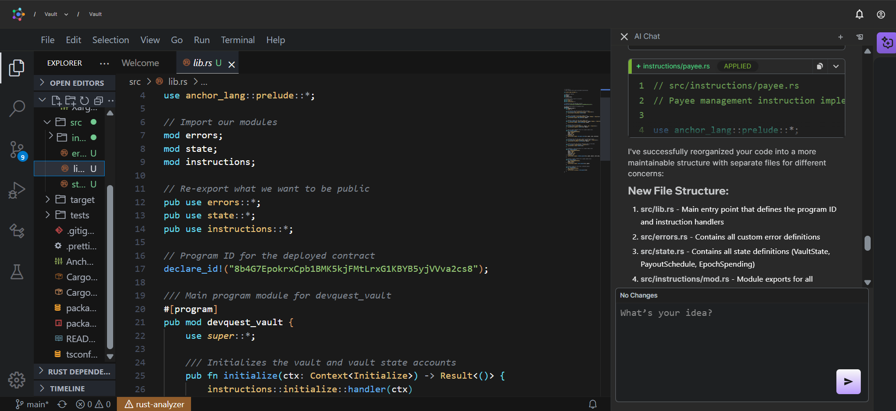
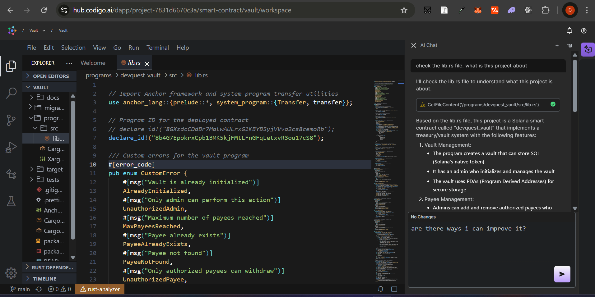

# AI-Assisted Workflow using Codigo DevAI

This document outlines the AI-assisted workflow employed in the development of this project using Codigo DevAI.




## 🚀 Introduction

Codigo DevAI was utilized throughout the development lifecycle of this project to enhance productivity, streamline coding, and automate repetitive tasks.

## 🧠 Why Codigo DevAI?

- Smart code suggestions powered by AI
- Accelerated development and debugging
- Context-aware assistance for Solana/Anchor development
- Seamless integration into IDE for real-time feedback

## 🔄 Workflow Overview

### 1. **Project Planning**

- Used Codigo DevAI to build on my initial project logic
- Outlined folder structure and planned modular microservices.

### 2. **Smart Code Generation**

- Used Codigo DevAI for generating Anchor program modules with boilerplate and procedural macros.
- Automated generation of instruction handlers, accounts struct, and validation logic.

### 3. **IDL Generation**

- Used to build Anchor the program

### 4. **Testing & Debugging**

- Debug suggestions were given by Codigo DevAI based on Anchor error codes and test outputs.
- Helped fix unresolved imports, invalid account errors, and instruction validation failures.

### 5. **Documentation**

- Codigo DevAI helped generate this Markdown document summarizing the process.

## Project Structure

The project follows a standard Anchor framework structure, with Codigo DevAI helping to organize files logically:

```
vault/
├── Anchor.toml           # Anchor configuration
├── Cargo.toml            # Rust dependencies
├── programs/             # Program source code
│   └── devquest_vault/   # Main program directory
├── src/                  # Program logic
│   ├── errors.rs         # Error definitions
│   ├── instructions/     # Instruction handlers
│   │   ├── close.rs
│   │   ├── deposit.rs
│   │   ├── initialize.rs
│   │   ├── mod.rs
│   │   ├── payee.rs
│   │   └── withdraw.rs
│   ├── lib.rs            # Program entry point
│   └── state.rs          # Account structures
├── tests/                # Test scripts
│   └── devquest_vault.ts # Main test file
└── migrations/           # Deployment scripts
    └── deploy.ts         # Deployment script
```

## ✅ Benefits Realized

- 3x faster iteration
- Reduced boilerplate and syntax errors
- Enhanced learning through contextual AI explanations
- More time spent on logic and architecture, less on repetitive syntax

## 🛠 Tools & Commands Used

```bash
anchor build
anchor test
```

> Codigo DevAI plugged into IDE to assist with the above.

## 📌 Conclusion

Using Codigo DevAI, VSCode, alongside Anchor and Solana tools provided a robust, efficient, and AI-enhanced workflow to ship high-quality code faster and with greater confidence.
